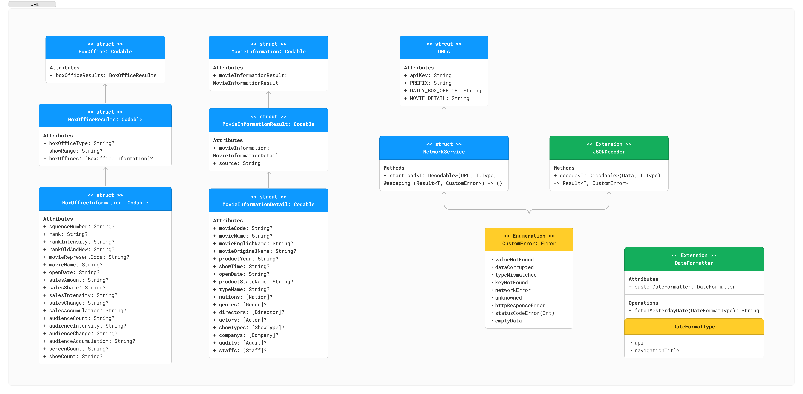

## 박스오피스 프로젝트 저장소
### 목차
- [1. 소개](#1-소개)
- [2. 팀원](#2-팀원)
- [3. 타임라인](#3-타임라인)
- [4. 프로젝트 구조](#4-프로젝트-구조)
- [5. 트러블 슈팅](#5-트러블-슈팅)
- [6. 팀 회고](#6-팀-회고)
- [7. 참고 자료](#7-참고-자료)

---
### 1. 소개
- 박스오피스 앱은 영화진흥위원회의 일별 박스오피스와 영화 상세정보 OPEN API로부터 데이터를 받아와 어제의 박스오피스 순위를 출력해줍니다. 또한 해당 영화를 클릭하면 영화 상세정보를 볼 수 있습니다.

### 2. 팀원
|  |  |  |
| :-: | :-: | :-: |
| Danny ([Github](https://github.com/dannykim1215)) | Diana ([Github](https://github.com/Diana-yjh)) | gama ([Github](https://github.com/forseaest))

### 3. 타임라인
| 날짜 | 제목 |
| --- | --- |
| 24.04.02(화) ~ 04.3(수) | 프로젝트 파일, git 설정파일 정리 및 JSONDecoder 구현 |
| 24.04.04(목) ~ 04.05(금) | 네트워크 타입 구현 및 API_KEY 숨김 설정 |
| 24.04.08(월) ~ 04.12(금) | 모델 구현 및 에러처리를 위한 커스텀 에러 타입 구현</br>CollectionView 구현 및 constraint 설정 |

### 4. 프로젝트 구조


### 5. 트러블 슈팅
#### 1. ❗️NetworkService 타입의 startLoad() 메소드의 Completion Handler 활용 문제
##### 📌 문제 상황
 - startLoad() 메소드의 Data가 escaping 내부에서 얻어와서 이후에 사용할 때 이 데이터 활용에 대한 고민이 있었고, 메소드 종료 후 도출되는 값이기 때문에 어떻게 return 값으로 받아야 할지 고민되었었습니다.
```swift
class NetworkService {
    func startLoad<T: Decodable>(url: URL, type: T.Type) {
        let task = URLSession.shared.dataTask(with: url) { data, response, error in
		...
	}
    }
    task.resume()
    ...
}
```

##### 🛠️ 해결 방법
 - @escaping과 Result 타입을 활용하여 성공한 디코딩한 데이터 또는 실패한 디코딩 에러값을 받아오게 하였습니다. 그리하여 dataTask Completion Handler 내부에 completion()을 이용하였고, 해당 디코딩 결과 데이터를 전달해줄 수 있었습니다.
```swift
class NetworkService {
    func startLoad<T: Decodable>(url: URL, type: T.Type, completion: @escaping (_ result: Result<T, CustomError>) -> ()) {
        let task = URLSession.shared.dataTask(with: url) { data, response, error in
	...
        }
    task.resume()												
	}
	...
}
```

#### 2. ❗️DateFormatter 비용 문제
##### 📌 문제 상황
```Swift
extension DateFormatter {
    func fetchTodayDate() -> String {
        self.dateFormat = "yyyyMMdd"
        return self.string(from: Date())
    }
}
```
 - 오늘의 날짜를 원하는 형식으로 받기 위해서 DateFormatter가 필요했고, DateFormatter 익스텐션에 해당 함수를 구현하여 사용하게 되었다. 그러나 DateFormatter는 인스턴스를 생성해서 사용할 때 비용이 많이 드는 문제로, 다른 방법이 필요했다.
##### 🛠️ 해결 방법
```Swift
extension DateFormatter {
    enum DateFormatType: String {
        case api = "yyyyMMdd"
        case navigationTitle = "yyyy-MM-dd"
    }
    
    static let customDateFormatter: DateFormatter = {
        let formatter = DateFormatter()
        formatter.locale = Locale(identifier: "ko_KR")
        return formatter
    }()
    
    static func fetchYesterdayDate(dateFormatType: DateFormatType) -> String {
        self.customDateFormatter.dateFormat = dateFormatType.rawValue
        let yesterdayDate = Date() - 86400
        return self.customDateFormatter.string(from: yesterdayDate)
    }
}
```
- 인스턴스를 생성해서 사용할 때마다 비용이 많이 드는 DateFormatter 클래스에 대한 방법으로 싱글톤 패턴 혹은 타입 프로퍼티/메소드를 떠올렸다. 싱글톤의 경우, 전역적으로 사용되어지는 것이 의의이자 목적인데 step 2에서는 오늘의 박스 오피스를 조회할 때의 url과 같은 국소적인 부분에서만 사용되고 있었다. 따라서 static 키워드를 붙여 타입 메소드로 전환하고, DateFormatter를 리턴시키는 타입 프로퍼티를 추가함으로써 인스턴스화를 거치지 않아도 사용할 수 있게 코드를 수정하였다.
- 또한 화면에 출력되는 형식과 API에 파라미터로 전달되어야 하는 형식이 다르므로, DateFormatter 내부에 열거형을 작성하였고 형식에 대해 원시값을 추가해주었다. 박스오피스 순위는 실시간으로 계산된 값이 아닌, 적어도 하루가 지나 결정되는 정적인 값이므로 코드에서는 오늘이 아닌 어제의 박스오피스 순위를 나타내도록 Date()에서 24시간과 동일한 86400초를 빼서 구현하게 되었다.

### 6. 팀 회고
#### 우리팀이 잘한 점 😍
- Danny
  - 3명이라서 일정 조율이 어려울 수도 있다고 생각했었으나, 일정 조율도 잘 되었고 적극적으로 모여서 프로젝트를 진행했던 것이 잘한 점 같습니다. 
- Diana 
  - 서로 충분히 의견을 나누며 진행하다보니 새로운 내용들을 같이 공부하는 기회가 생겨 너무 좋았습니다.
- gama 
  - 3명이라서 진행하기가 보다 수월했고, 코드에 대해서 이유를 묻고 답하며 배울 수 있는 좋은 기회였다.

#### 우리팀 개선할 점 🥲
- Danny
  - Step3 난이도 상승으로 인해 서로 개념 및 공부하는 시간이 많이 소비되어 같이 Step 3를 완료하지 못한 게 아쉽습니다.
- Diana
  - 모던 콜렉션뷰 구현이 쉽지 않아 STEP3을 완료하지 못한게 너무 아쉽습니다
- gama
  - 모던 콜렉션뷰를 구현해야 했으나 기존의 콜렉션뷰도 미숙한 탓에 스탭 3 이후로 스케쥴이 빠르게 진행할 수 없었다

### 7. 참고 자료
- [Apple 공식문서 - URLSession](https://developer.apple.com/documentation/foundation/urlsession)
- [Apple 공식문서 - Fetching website data into memory](https://developer.apple.com/documentation/foundation/url_loading_system/fetching_website_data_into_memory)
- [Apple 공식문서 - UICollectionViewCompositionalLayout](https://developer.apple.com/documentation/uikit/uicollectionviewcompositionallayout)
- [Apple 공식문서 - UICollectionViewFlowLayout](https://developer.apple.com/documentation/uikit/uicollectionviewflowlayout)
- [Apple 샘플 코드 - Implementing Modern Collection Views](https://developer.apple.com/documentation/uikit/views_and_controls/collection_views/implementing_modern_collection_views)
- [WWDC-Modern cell configuration](https://developer.apple.com/videos/play/wwdc2020/10027/)
- [WWDC-Lists in UICollectionView](https://developer.apple.com/videos/play/wwdc2020/10026)
- [Swift - 특정 문자열의 속성 변경](https://ios-development.tistory.com/654)
